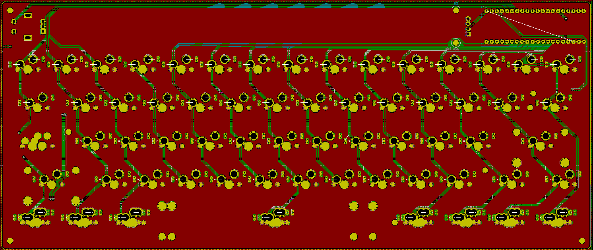
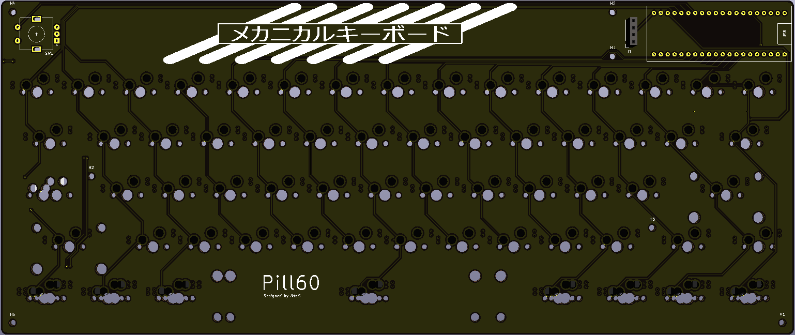
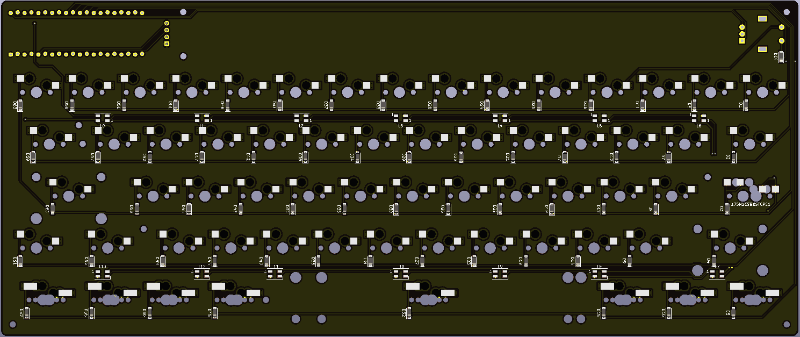

This is Pill 60, it offers various bottom row layout, a stepped caps, an OLED screen, and two rotary encoder, and uses Kailh Hotswap Socket, and underglow RGB LED.

layout is [this](http://www.keyboard-layout-editor.com/##@_name=Varity%2060&author=IktaS%3B&@_a:7&f:7%3B&=1&=1&=1&=1&=1&=1&=1&=1&=1&=1&=1&=1&=1&_c=%2300ffdd%3B&=1&=1%3B&@_c=%23cccccc&w:1.5%3B&=1.5&=1&=1&=1&=1&=1&=1&=1&=1&=1&=1&=1&=1&_c=%2300cc55&w:1.5%3B&=1.5%3B&@_c=%2350d38a&w:1.75%3B&=1.75&_c=%23cccccc%3B&=1&=1&=1&=1&=1&=1&=1&=1&=1&=1&=1&_c=%2300cc55&w:2.25%3B&=2.25%3B&@_c=%23aaaacc&w:2.25%3B&=2.25&_c=%23cccccc%3B&=1&=1&=1&=1&=1&=1&=1&=1&=1&=1&_c=%23cc77cc&w:1.75%3B&=1.75&=1%3B&@_c=%23995555&w:1.25%3B&=1.25&_w:1.25%3B&=1.25&_w:1.25%3B&=1.25&_c=%23889988&w:6.25%3B&=6.25&_c=%23558899&w:1.25%3B&=1.25&_w:1.25%3B&=1.25&_w:1.25%3B&=1.25&_w:1.25%3B&=1.25%3B&@_c=%23b3ce29&w:1.5%3B&=1.5&=1&_w:1.5%3B&=1.5&_c=%23939393&w:6%3B&=6&_c=%23558899&w:1.5%3B&=1.5&=1&=1&_w:1.5%3B&=1.5&_x:0.5&c=%2350d38a&w:1.25&w2:1.75&l:true%3B&=1.75)

This 60% keyboard that uses BluePill or STM32F103C8T6.This is my first board, Any feedback is appreciated. Contact me on Discord Ikta#8871.

